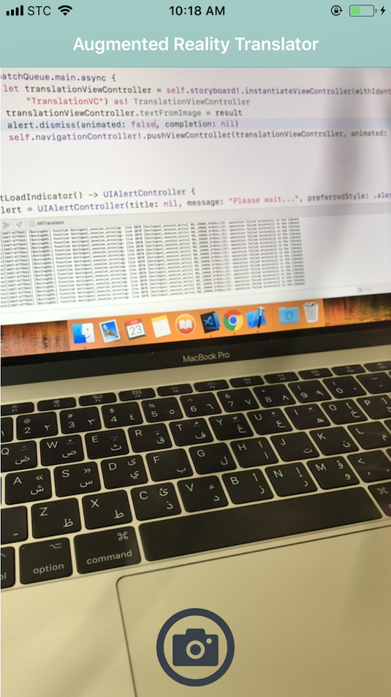
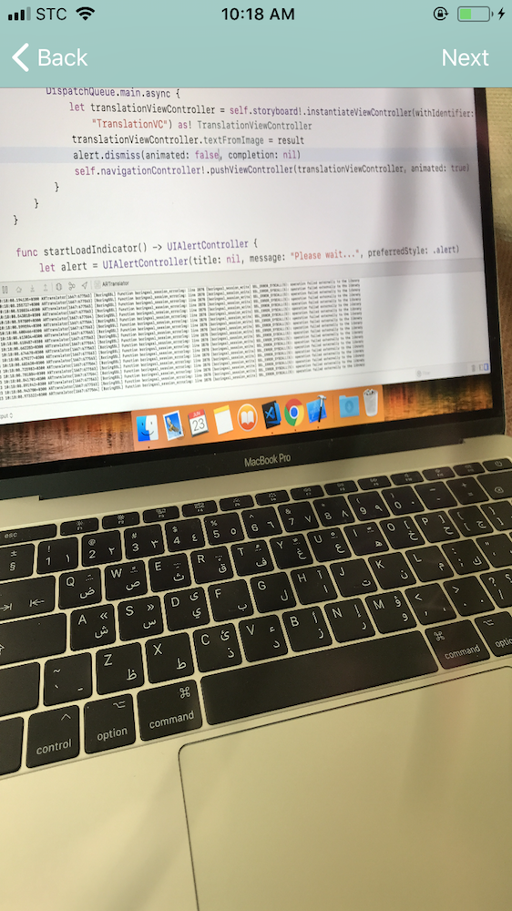
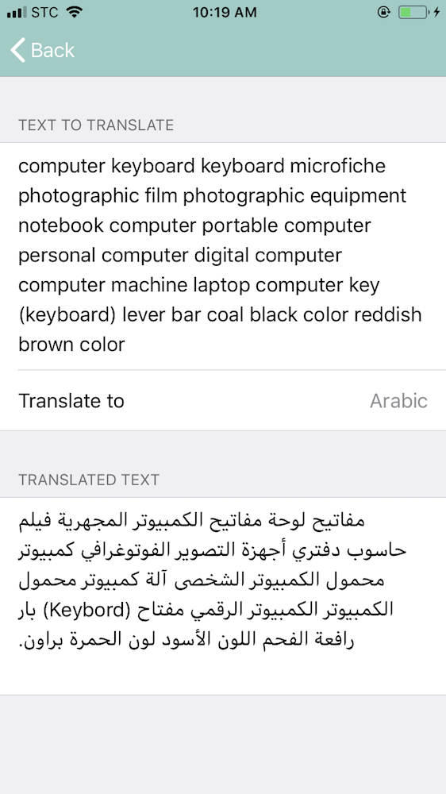
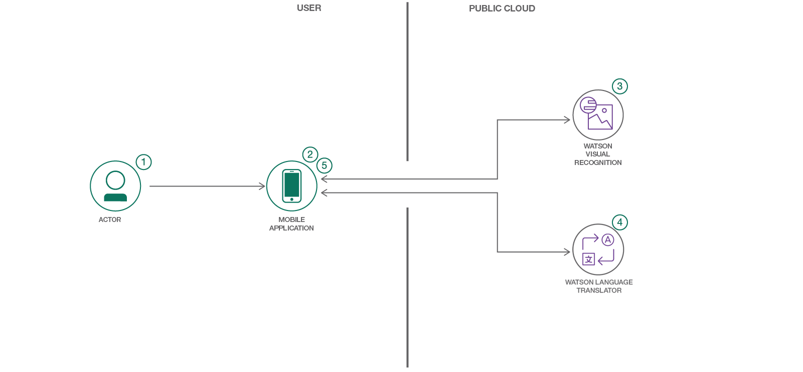

<div dir=rtl markdown=1>

لقراءة هذا الملف بلغة أخرى: [English](README.md). 
# أنشئ تطبيق ترجمة باستخدام تنقية الواقع المعزز

<table>
  <tr>
    <th>
      
    </th>
    <th>
      
    </th>
    <th>
    
    </th>
  </tr>
</table>
في هذه الرحلة للمطورين، سننشئ تطبيق آيفون باستخدام لغة سويفت، وخدمة Watson Visual Recognition، وخدمة Watson Language Translator.

 خدمة واتسون للتعرف البصري ستوظف لاكتشاف النصوص الموجودة في الصور الملتقطة. يمكن للمستخدم بعد ذلك ترجمة تلك النصوص إلى أي اللغات المدعومة من خدمة واتسون لترجمة اللغات. 

عندما تكمل هذه الرحلة، ستتعلم كيف:
* تنشئ تطبيق جوال يتعرف على النصوص الموجودة في الصورة باستخدام Watson Visual Recocnition
* ترجمة النص المكتوب باستخدام Watson Language Translator



## تسلسل الاستخدام
1. يلتقط المستخدم صورة عبر تطبيق الجوال لينتقل تلقائياً للواجهة التالية. 
2. يؤكد المستخدم الصورة التي التقطها بالضغط على زر التالي.
3. يتم معالجة الصورة اللتي التقطها المستخدم عبر Watson Visual Recocnition لتحديد النص الذي كتب بالإنجليزية في الصورة.
4. يختار المستخدم لغة لترجمة النص المحدد.

## المكونات المتضمنة

* [IBM Watson Visual Recognition](https://www.ibm.com/watson/developercloud/visual-recognition): باستخدام الذكاء الاصطناعي يستطيع واتسون التعرف على محتوى الصورة سواء كان نصاً، أو وجوهاً، ويحدد  الخصائص مثل العمر التقريبي والجنس للأشخاص، والألوان للأشياء.
* [IBM Watson Language Translator](https://www.ibm.com/watson/developercloud/language-translatorl): خدمة لترجمة النصوص من لغة إلى أخرى. الخدمة توفر عدة نماذج مع إمكانية بناء نماذج ترجمة مخصصة.
* [Eureka](https://github.com/xmartlabs/Eureka): إطار هيكل لبناء نماذج أو استبيانات في تطبيقات الآي فون.

# التقنيات

* [الذكاء الاصطناعي](https://medium.com/ibm-data-science-experience): يمكن توظيف الذكاء الاصطناعي  في مختلف الحلول لصنع تقنيات التي تسبب تغيرات جذرية في السوق.
* [تطبيقات الجوال](https://mobilefirstplatform.ibmcloud.com/): الأنظمة أصبحت تستخدم التكنولوجيا النقالة بشكل متزايد كمنصة لتوصيل خدماتها.

# فيديو

<!-- [](https://www.youtube.com/watch?v=Jxi7U7VOMYg) -->

# الخطوات


### الخطوة ١. استنسخ المشروع

- عبر موجه الأوامر، أدخل الأمر التالي لاستنساخ المشروع
```
git clone [repo link]
```
### الخطوة ٢. أنشئ الخدمات السحابية

- سجل دخولك في منصة سحابة آي بي إم. أو [سجل حساب جديد](http://bluemix.net/) إذا لم يكن لديك حساب.

- من صفحة catalog في موقع سحابة آي بي إم, أنشئ نموذج من خدمة [Watson Visual Recognition](https://console.bluemix.net/catalog/services/visual-recognition). ثم انسخ مفتاح الواجهة البرمجية (apikey) الخاص بك من صفحة Service credentials.

- من صفحة catalog في موقع سحابة آي بي إم, أنشئ نموذج من خدمة [Watson Language Translator](https://console.bluemix.net/catalog/services/language-translator).  ثم انسخ اسم المستخدم وكلمة المرور الخاصة بك من صفحة Service credentials.

### الخطوة ٣. إعداد التطبيق

- عندما تفتح التطبيق في Xcode, ألصق بياناتك التي نسختها من الخطوة السابقة في ملف `Credintials.swift`. 

### الخطوة ٤. تحميل أطر الهيكلة اللازمة

- بعد تحميل [Carthage](https://github.com/Carthage/Carthage#installing-carthage), أدخل الأمر التالي في موجه الأوامر لإنشاء ملف Cartfile
```
touch Cartfile
```

- حدد أطر الهيكلة في الملف الذي تم إنشاءه
```
github "watson-developer-cloud/swift-sdk"
github "xmartlabs/Eureka" ~> 4.0
```

- بعدها أدخل الأمر التالي لتحميل أطر الهيكلة التي تم تحديدها
```
carthage update --platform iOS
```
بعد ذلك، سترى الأطر موجودة في مجلد `Carthage/Build/iOS`

- في ذلك المجلد، حدد الأطر التالية:
  - VisualRecognitionV3.framework 
  - LanguageTranslatorV2.framework
  - Eureka.framework 

  ثم اسحبها إلى قسم **Embedded Binaries** في صفحة General في Xcode. وبذلك تكون انتهيت من إعداد التطبيق، وبإمكانك تجربته. 🎉
</div>