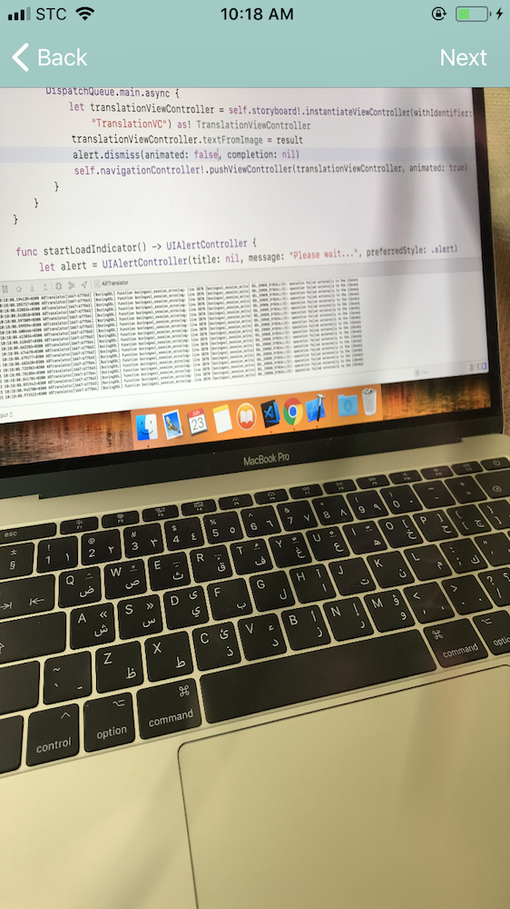
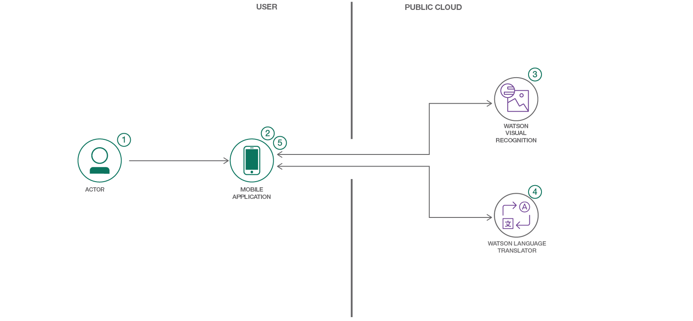

<!-- [](https://travis-ci.org/IBM/watson-banking-chatbot)-->

*Read this in other languages: [العربية](README-ar.md).* 

# Create a Mobile App for Augmented Reality Translation

<table>
  <tr>
    <th>
      
    </th>
    <th>
      
    </th>
    <th>
    
    </th>
  </tr>
</table>

In this developer journey, we will create an iOS mobile app using Swift, Watson Visual Recognition and Watson Language Translator. The Visual Recognition service will be used to identify text of a captured images. That text can then be translated to any of the supported languages by Watson Language Translator.

When the reader has completed this journey, they will understand how to:

* Create a mobile app that recognizes text in a photo using Watson Visual Recognition
* Use Watson Language Translator to translate written text



## Flow
1. The user takes a photo via the mobile app.
2. User move to the second user interfact to confirm and click **Next**.
3. image is processed with Visual Recognition to detect English text in the captured image.
4. User chooses a language to translate the English text into.

## With Watson

Want to take your Watson app to the next level? Looking to leverage Watson Brand assets? Join the [With Watson](https://www.ibm.com/watson/with-watson) program which provides exclusive brand, marketing, and tech resources to amplify and accelerate your Watson embedded commercial solution.

## Included components

* [IBM Watson Visual Recognition](https://www.ibm.com/watson/developercloud/visual-recognition): Quickly and accurately tag, classify and train visual content using machine learning.
* [IBM Watson Language Translator](https://www.ibm.com/watson/developercloud/language-translatorl): Translate text from one language to another. The service offers multiple IBM provided translation models that you can customize based on your unique terminology and language.
* [Eureka](https://github.com/xmartlabs/Eureka): Eureka is a form builder framework for iOS applications.

# Technologies

* [Artificial Intelligence](https://medium.com/ibm-data-science-experience): Artificial intelligence can be applied to disparate solution spaces to deliver disruptive technologies.
* [Mobile](https://mobilefirstplatform.ibmcloud.com/): Systems of engagement are increasingly using mobile technology as the platform for delivery.

# Watch the Video

<!-- [](https://www.youtube.com/watch?v=Jxi7U7VOMYg) -->

# Steps


### Step 1. Clone the repository

- At a command line, clone this repo:
  ```
  git clone [repo link]
  ```
### Step 2. Create required services

- Log into your IBM Cloud account. [Sign up](http://bluemix.net/) if you do not already have one.

- From the IBM Cloud catalog, create a [Watson Visual Recognition](https://console.bluemix.net/catalog/services/visual-recognition) service. Create a set of credentials and identify your API key.

- From the IBM Cloud catalog, create a [Watson Language Translator](https://console.bluemix.net/catalog/services/language-translator) service. Create a set of credentials and copy your username and password.

### Step 3. Configure service credintials

- When you run the app on Xcode, go to `Credintials.swift` and paste your own credentials from the previous step. 

### Step 4. Download the required frameworks

- Using [Carthage](https://github.com/Carthage/Carthage#installing-carthage), run the following command to create a Cartfile
  ```
  touch Cartfile
  ```

- Specify the frameworks in your carthage file
  ```
  github "watson-developer-cloud/swift-sdk"
  github "xmartlabs/Eureka" ~> 4.0
  ```

- Then run the following command to build the dependencies and frameworks:
  ```
  carthage update --platform iOS
  ```
  You should then see the downloaded frameworks in `Carthage/Build/iOS` folder

- In that folder, select the following frameworks: 
  - VisualRecognitionV3.framework 
  - LanguageTranslatorV2.framework
  - Eureka.framework 
  
  and drag it to the Embedded Library section of your target’s General tab and you're done 🎉
